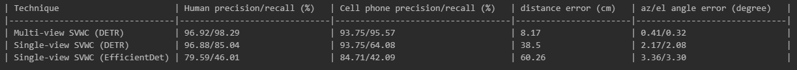

# WCM_SVWC
This repository is the implementation of object detectors used in the paper "Role of Sensing and Computer Vision in 6G Wireless Communications". 

# Dataset Preparation
Please download the dataset from (https://drive.google.com/drive/folders/1UeVr8K7ie4sKeChx-r0gw4tGd1U1Vjvs?usp=drive_link) and then put the data folder next to DETR and EfficientDet folders.
The dataset consists of 104 pairs of RGB and depth images acquired from 9 distinct wireless environments including classroom, hallway, gym, and food court. 
In each image, up to 5 people appear, each holding a cell phone.

# Methods
By running detr.py in DETR folder, we can detect humans and cell phones in the RGB images using DETR.

By running inference.py in EfficientDet folder, we can detect humans and cell phones in the RGB images using EfficientDet.

To evaluate the object detection results, run calc_metric.py.

The codes have been tested on torch2.2.1+cuda11.8.

# Results

